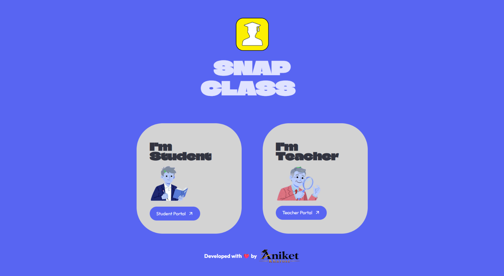
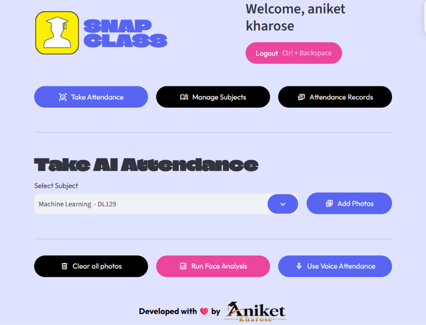
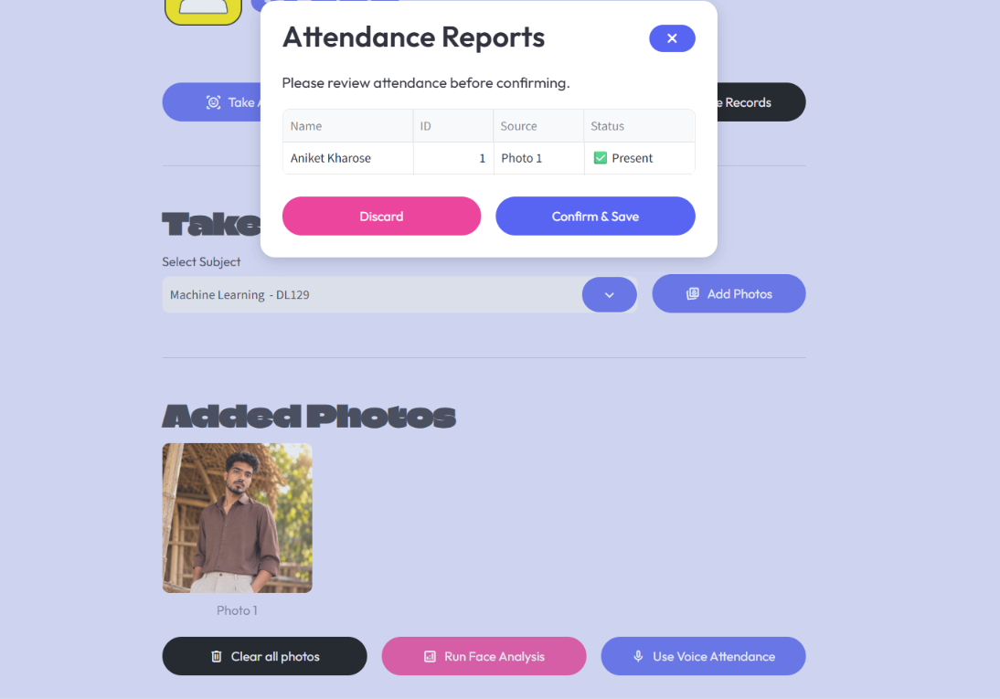
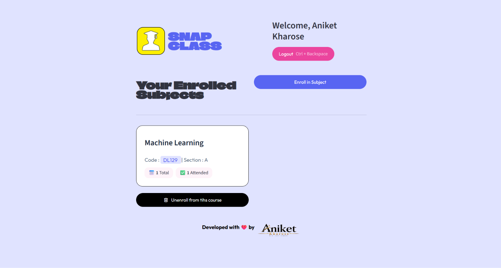
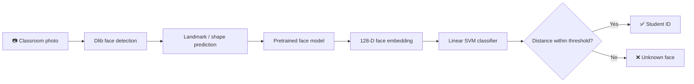
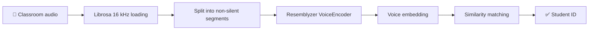
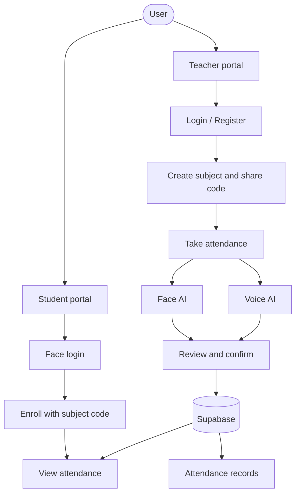

<div align="center">

# 📸 SnapClass

### *Say cheese. You're marked present.*

**Intelligent AI attendance using Face Recognition and Voice Recognition**


[🚀 Live Demo](https://sanpclass-aniketkharose.streamlit.app/) ·
[💻 Source Code](https://github.com/aniketkharose/intelligent-ai-attendance)

</div>

---

## 🎬 The Problem

Roll calls eat up class time. Proxy attendance is easy. Paper registers get lost.

**SnapClass fixes it with AI.** A teacher snaps one photo of the classroom, or records a few seconds of audio, and SnapClass works out *who is present* by recognizing faces and voices. The teacher reviews the result, confirms it, and the attendance is saved.

> ⏳ **Note:** The app is hosted on Streamlit Community Cloud. If it has been idle, it may show a "wake up" screen. Click the button and give it a few seconds.

---

## 📸 Screenshots

| Home | Teacher Portal |
|:---:|:---:|
|  |  |

| Face Attendance | Student Portal |
|:---:|:---:|
|  |  |

---

## ✨ What SnapClass Can Do

<table>
<tr>
<td width="50%" valign="top">

### 👨‍🎓 Student Portal
- 🙂 **Face login** (no password to remember)
- 📝 Register with a face image
- 🎙️ Optional **voice profile** enrollment
- 🔑 Join a class using a **subject code**
- 📚 View enrolled subjects
- 📊 View attendance information
- 🚪 Unenroll from a subject

</td>
<td width="50%" valign="top">

### 👨‍🏫 Teacher Portal
- 🔐 Secure register and login (**bcrypt** hashed passwords)
- ➕ Create multiple subjects with code and section
- 🔗 Share subject codes and QR codes
- 📷 Upload classroom photos
- 🧑‍🤝‍🧑 **Face-based** attendance
- 🎤 **Voice-based** attendance
- ✅ Review and confirm before saving
- 📈 Attendance records and statistics

</td>
</tr>
</table>

---

## 🧠 The AI Behind It

SnapClass uses **pretrained models** for feature extraction. No deep neural network is trained from scratch. The project builds the recognition pipeline and the classification logic around them.

### 🙂 Face Recognition Pipeline



- Dlib detects each face and the pretrained model turns it into a **128-dimensional embedding**.
- A **linear SVM** from scikit-learn predicts which student the embedding belongs to.
- A **Euclidean-distance threshold** double-checks that the face really resembles the stored student embedding, which reduces false matches.

### 🎙️ Voice Recognition Pipeline



- Audio is resampled to **16 kHz** and split into speech segments.
- Resemblyzer's pretrained **VoiceEncoder** creates speaker embeddings.
- Each segment is compared against enrolled student voice profiles using embedding similarity.

---

## 🔄 How a Class Session Flows



---

## 🏗️ Architecture

```text
SnapClass
│
├── Student Portal      → face login, registration, voice enrollment, enrollment, attendance view
├── Teacher Portal      → login, subjects, face attendance, voice attendance, records
├── AI Pipelines        → face recognition, voice recognition
└── Supabase Database   → teachers, students, subjects, enrollments, attendance logs
```

---

## 🛠️ Tech Stack

| Technology | Purpose |
|---|---|
| **Python** | Core language |
| **Streamlit** | Web app and UI |
| **Supabase** | Database and backend storage |
| **Dlib** | Face detection and processing |
| **face_recognition_models** | Pretrained face model |
| **scikit-learn** | SVM student classifier |
| **NumPy** | Embeddings and numeric work |
| **Resemblyzer** | Voice embeddings |
| **Librosa** | Audio loading and resampling |
| **Pandas** | Attendance tables and processing |
| **bcrypt** | Password hashing |
| **Pillow** | Image handling |
| **Segno** | QR code generation |
| **Streamlit Community Cloud** | Deployment |

---

## 📂 Project Structure

```text
intelligent-ai-attendance/
│
├── app.py
├── requirements.txt
├── .gitignore
│
├── .devcontainer/
│   └── devcontainer.json
│
└── src/
    ├── components/
    │   ├── dialog_add_photo.py
    │   ├── dialog_attendance_results.py
    │   ├── dialog_auto_enroll.py
    │   ├── dialog_create_subject.py
    │   ├── dialog_enroll.py
    │   ├── dialog_share_subject.py
    │   ├── dialog_voice_attendance.py
    │   ├── footer.py
    │   ├── header.py
    │   └── subject_card.py
    │
    ├── database/
    │   ├── config.py
    │   └── db.py
    │
    ├── pipelines/
    │   ├── face_pipeline.py
    │   └── voice_pipeline.py
    │
    ├── screens/
    │   ├── home_screen.py
    │   ├── student_screen.py
    │   └── teacher_screen.py
    │
    └── ui/
        └── base_layout.py
```

---

## 🧭 Step by Step

<details>
<summary><b>👨‍🏫 Teacher: taking face attendance</b></summary>

1. Register or log in (username, name, password).
2. Create a subject with a code, name and section.
3. Share the subject code so students can enroll.
4. Select the subject and add classroom photos.
5. SnapClass detects faces, creates embeddings and predicts student IDs with the SVM.
6. The distance threshold filters weak matches.
7. Review the result, then confirm to save attendance to Supabase.

</details>

<details>
<summary><b>🎤 Teacher: taking voice attendance</b></summary>

1. Select the subject and record classroom audio.
2. Audio is loaded at 16 kHz and split into non-silent segments.
3. Voice embeddings are compared with enrolled student profiles.
4. Matching students are marked present.
5. Review, confirm and save.

</details>

<details>
<summary><b>👨‍🎓 Student: getting started</b></summary>

1. Register with your name and a face image.
2. Optionally record a voice sample for voice attendance.
3. Log in using face recognition.
4. Enroll in a subject using its subject code.
5. View enrolled subjects and attendance.

</details>

<details>
<summary><b>📈 Attendance records</b></summary>

Records are grouped by attendance session and show:

| Time | Subject | Subject Code | Present / Total |
|---|---|---|---|

</details>

---

## 🗄️ Database (Supabase)

| Table | Stores |
|---|---|
| `teachers` | Teacher account information |
| `students` | Student ID, name, face embedding, voice embedding |
| `subjects` | Subject ID, code, name, section, teacher ID |
| `subject_students` | Which students are enrolled in which subjects |
| `attendance_logs` | Student ID, subject ID, timestamp, present / absent status |

---

## 🚀 Run It Locally

### 1. Clone

```bash
git clone https://github.com/aniketkharose/intelligent-ai-attendance.git
cd intelligent-ai-attendance
```

### 2. Create a virtual environment

```powershell
python -m venv .venv
.\.venv\Scripts\Activate.ps1
```

### 3. Install dependencies

```bash
pip install -r requirements.txt
```

> 💡 Dlib can be tricky to build on Windows. This project uses `dlib-bin`, a prebuilt package, and pins `setuptools<70.0.0` for compatibility with `face_recognition_models`.

### 4. Add Supabase secrets

Create `.streamlit/secrets.toml`:

```toml
SUPABASE_URL = "https://your-project.supabase.co"
SUPABASE_KEY = "your-supabase-key"
```

> ⚠️ Never commit `secrets.toml` or real credentials. On Streamlit Community Cloud, add the same values under the app's **Secrets** settings.

### 5. Launch

```bash
streamlit run app.py
```

Open http://localhost:8501 🎉

---

## ☁️ Deployment

| Setting | Value |
|---|---|
| Platform | Streamlit Community Cloud |
| Repository | `aniketkharose/intelligent-ai-attendance` |
| Branch | `main` |
| Main file | `app.py` |
| Live app | [sanpclass-aniketkharose.streamlit.app](https://sanpclass-aniketkharose.streamlit.app/) |

Push to GitHub and Streamlit Community Cloud redeploys automatically.

---

## 🔒 Security and Privacy

- 🔑 Teacher passwords are hashed with **bcrypt**.
- 🗝️ Supabase credentials live in Streamlit secrets and are never committed.
- 🧬 Face and voice embeddings are **biometric data**. Treat them as sensitive.
- 🛡️ For real-world use, add proper access controls and database security policies (for example, Supabase Row Level Security) and obtain consent from students.

---

## 🔮 Ideas for the Future

- Anti-spoofing (liveness detection) so a printed photo cannot mark attendance
- Attendance analytics dashboards and CSV export
- Row Level Security on all Supabase tables
- Low-attendance alerts for students and teachers
- Mobile-friendly capture flow

---

## 🎓 What This Project Demonstrates

Face detection and 128-D embeddings · SVM classification · Distance-based verification · Audio preprocessing at 16 kHz · Speaker embeddings and similarity matching · Role-based web apps in Streamlit · Supabase integration · Password hashing · Cloud deployment

---

## 👨‍💻 Developer

**Aniket Kharose**
BE Electronics & Telecommunication Engineering

[](https://github.com/aniketkharose)

*Built with ❤️ using Python, Streamlit and AI/ML.*

---

## 📄 License

No open-source license is specified yet. To allow others to reuse the code, add a `LICENSE` file such as MIT or Apache-2.0.

---

## ⭐ Acknowledgements

Streamlit · Dlib · face_recognition_models · scikit-learn · Resemblyzer · Librosa · NumPy · Pandas · Supabase · bcrypt · Segno

<div align="center">

**If you like SnapClass, give it a ⭐**

</div>
